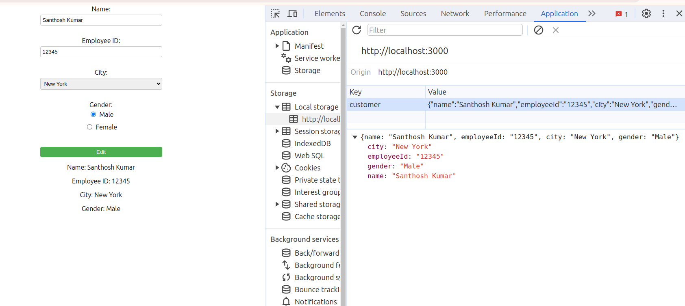

# Task
Create a customer information form with custom fields:
Name: Textbox (String, Mandatory)
Label: Name
Placeholder: Enter Name
Employee ID: Textbox (Integer, Mandatory)
Label: Employee ID
Placeholder: Enter Employee ID
City: Dropdown (Predefined options: New York, London, Tokyo; Mandatory)
Label: City
Options: ▼ Select City ▼, New York, London, Tokyo
Gender: Checkbox (Male/Female, Mandatory)
Label: Gender
Options: [ ] Male [ ] Female
Functionality:
Save data in local storage upon form submission.  (done)
--- Refer this image  
Display saved data in read-only format. (done)
Enable editing upon clicking the name. (done)
Save and display the latest edited data. (done)

In the project directory, you can run:
### `npm start`

Runs the app in the development mode.\
Open [http://localhost:3000](http://localhost:3000) to view it in your browser.

** Task Descripton
-- Click the edit button and Enter the data of Customer. On click of save button the data is stored in local storage in real time
--Customer Data is stored in local Storage
## Refer this image 

--You can edit the customer data on Click of name or with edit button and save the data that will be reflected in local Storage in real time 

